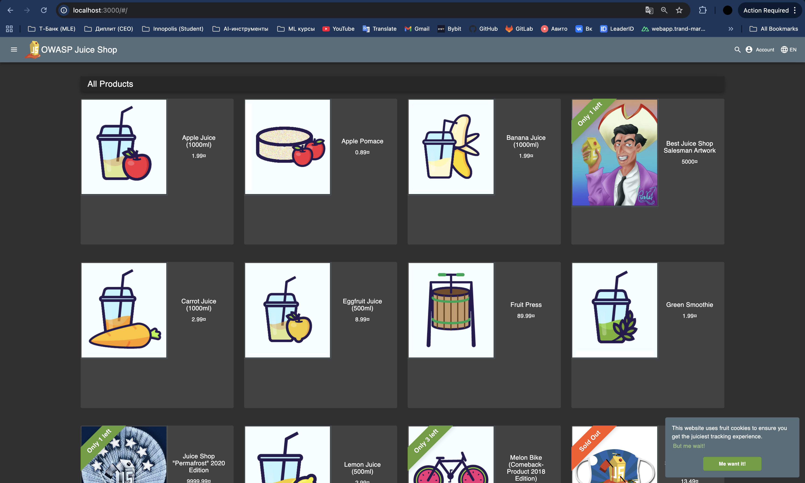

# Triage Report — OWASP Juice Shop

## Scope & Asset
- Asset: OWASP Juice Shop (local lab instance)
- Image: bkimminich/juice-shop:v19.0.0
- Release link/date: [v19.0.0](https://github.com/juice-shop/juice-shop/releases/tag/v19.0.0) — 2025-09-04
- Image digest (optional): not captured

## Environment
- Host OS: macOS (Darwin 24.6.0)
- Docker: 28.2.2

## Deployment Details
- Run command used: `docker run -d --name juice-shop -p 127.0.0.1:3000:3000 bkimminich/juice-shop:v19.0.0`
- Access URL: http://127.0.0.1:3000
- Network exposure: 127.0.0.1 only [x] Yes  [ ] No

## Health Check
- Page load: 
- API check: v19 uses `/api/Products` (replaces `/rest/products`). Output:

```
$ curl -s http://127.0.0.1:3000/api/Products | head -5
{"status":"success","data":[{"id":1,"name":"Apple Juice (1000ml)","description":"The all-time classic.","price":1.99,...
```

## Surface Snapshot (Triage)
- Login/Registration visible: [x] Yes  [ ] No
- Product listing/search present: [x] Yes  [ ] No
- Admin or account area discoverable: [x] Yes  [ ] No
- Client-side errors in console: [ ] Yes  [x] No
- Security headers: `curl -I` — CSP/HSTS absent; CORS allows `*`

## Risks Observed (Top 3)
1. CORS `Access-Control-Allow-Origin: *` — any origin can make requests; facilitates CSRF and data exfiltration.
2. No Content-Security-Policy — increases XSS and malicious script injection risk.
3. No Strict-Transport-Security — HTTP downgrade and MITM possible in production.

---

## Task 2 — PR Template Setup

- Created `.github/pull_request_template.md` with Goal, Changes, Testing, Artifacts & Screenshots; checklist (3 items).
- Added template to `main` first (required for GitHub to auto-fill).
- PR description auto-fills from template when opening PR from `feature/lab1`.
- Templates standardize review: everyone knows what to document and check.

---

## GitHub Community

Stars bookmark projects and signal popularity; they encourage maintainers. Following developers helps discover their work, learn from their code, and build professional connections.
