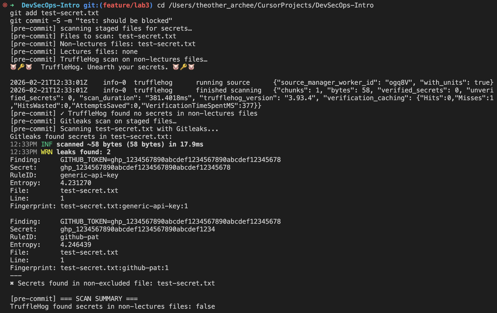
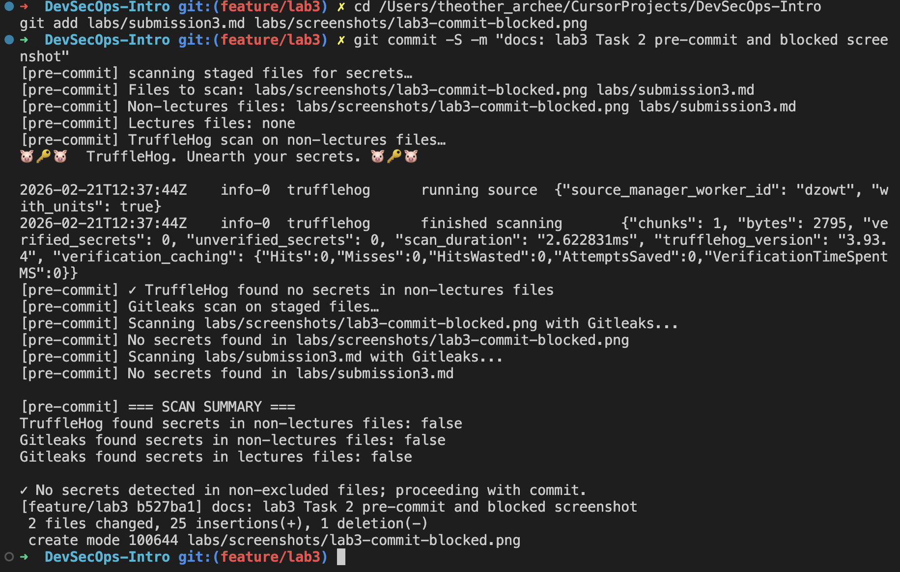

# Lab 3 — Secure Git

## Task 1 — SSH Commit Signature Verification

### Benefits of signing commits

Signed commits prove that a commit was made by the holder of the signing key. They protect against impersonation (someone pushing commits with your name/email) and tampering. On GitHub, signed commits show a **Verified** badge, so reviewers and automation can trust the author.

### SSH key setup and configuration

SSH commit signing is configured as follows:

- **Signing key:** SSH key (e.g. `ed25519`) added to GitHub under Settings → SSH and GPG keys, with **Signing** usage.
- **Git config:** `user.signingkey` points to the public key; `commit.gpgSign true` and `gpg.format ssh` enable SSH signing for every commit.

### Evidence: Verified badge on GitHub

Commits on this branch are signed; GitHub shows them as **Verified**.

### Why commit signing is critical in DevSecOps

In DevSecOps, pipelines and policies often rely on "who made this change." Without signing, author metadata can be forged, so you cannot trust it for audit or branch protection. Signed commits give a cryptographic guarantee of identity, which supports compliance, code ownership, and secure CI/CD (e.g. only accepting signed commits in main).

---

## Task 2 — Pre-commit Secret Scanning

### Setup

The pre-commit hook is installed at `.git/hooks/pre-commit`. It runs on every commit and:

- Scans **staged files** with **TruffleHog** (Docker) for non-`lectures/` paths.
- Scans all staged files with **Gitleaks** (Docker).
- **Blocks the commit** if a secret is found outside `lectures/`; secrets only in `lectures/` are allowed (educational content).

The script was made portable for macOS (replaced `mapfile` with a `while read` loop). The hook is executable (`chmod +x`).

### Test 1: Commit blocked when secret is present

A test file containing a fake GitHub token (`ghp_...`) was staged. Gitleaks detected it; the hook blocked the commit.

### Test 2: Commit allowed when no secrets

After removing the test file and staging only safe files (e.g. `submission3.md`, screenshots), the hook reported no secrets and the commit succeeded.

### How automated secret scanning prevents incidents

Scanning at pre-commit stops secrets from ever entering the repo. Once pushed, history is hard to clean and credentials can be harvested by bots. Blocking at commit time keeps keys out of the tree, reduces blast radius, and fits into DevSecOps “shift-left” practices without blocking normal work (e.g. excluding `lectures/` for training content).
