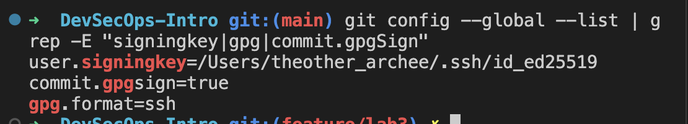
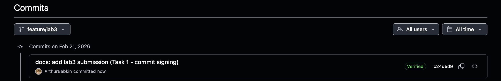

# Lab 3 — Secure Git

## Task 1 — SSH Commit Signature Verification

### Benefits of signing commits

Signed commits prove that a commit was made by the holder of the signing key. They protect against impersonation (someone pushing commits with your name/email) and tampering. On GitHub, signed commits show a **Verified** badge, so reviewers and automation can trust the author.

### SSH key setup and configuration

SSH commit signing is configured as follows:

- **Signing key:** SSH key (e.g. `ed25519`) added to GitHub under Settings → SSH and GPG keys, with **Signing** usage.
- **Git config:** `user.signingkey` points to the public key; `commit.gpgSign true` and `gpg.format ssh` enable SSH signing for every commit.

### Evidence: Verified badge on GitHub

Commits on this branch are signed; GitHub shows them as **Verified**.

### Why commit signing is critical in DevSecOps

In DevSecOps, pipelines and policies often rely on "who made this change." Without signing, author metadata can be forged, so you cannot trust it for audit or branch protection. Signed commits give a cryptographic guarantee of identity, which supports compliance, code ownership, and secure CI/CD (e.g. only accepting signed commits in main).

---

## Task 2 — Pre-commit Secret Scanning

*(To be filled after hook setup and tests.)*
